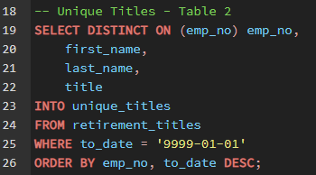
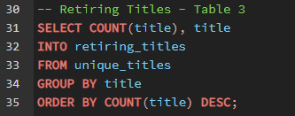
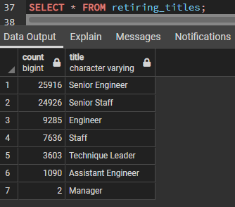
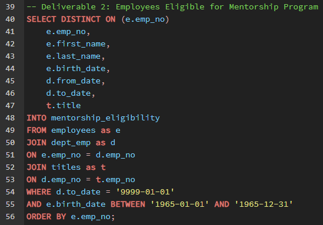
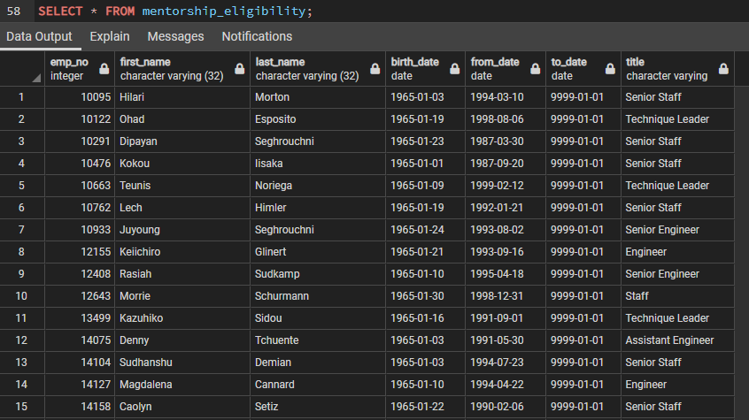

# Pewlett Hackard Analysis
## Overview of Analysis
### Purpose
The purpose of this project was to run a database analysis for the company Pewlett Hackard. They are aware that a large number of employees would be nearing retirement age and wanted more insight on who was ready to retire, so they could prepare for the change. We needed to determine the number of employees that are eligible to retire, see which department they are a part of and to figure out which senior level employees are nearing retirement. Then find employees who would be eligible to participate in a mentorship program for new hires.

## Results
### Retiring Employees by Titles
To find the number of eligible employees for retirement by their titles, we created a '[retirement_titles](https://github.com/rickystuart1/Pewlett-Hackard-Analysis/blob/main/Data/retirement_titles.csv)' table showing the titles of employees born between the range of 01-01-1952 and 12-31-1955. We did this by using an inner join of '[employees](https://github.com/rickystuart1/Pewlett-Hackard-Analysis/blob/main/Data/employees.csv)' and '[titles](https://github.com/rickystuart1/Pewlett-Hackard-Analysis/blob/main/Data/titles.csv)' tables.

We then removed duplicate rows that held employees who had switched titles over the years and put them into a new table called '[unique_titles](https://github.com/rickystuart1/Pewlett-Hackard-Analysis/blob/main/Data/unique_titles.csv)'. We did this by using the distict on function for the employee number and making sure their employment status was active by setting to_date equal to '9999-01-01'.

Finally, the count and group by functions were used to count the number of employees that were going to retire by their title. They were put into the '[retiring_titles](https://github.com/rickystuart1/Pewlett-Hackard-Analysis/blob/main/Data/retiring_titles.csv)' table. The results showed that a large number of Pewlett Hackards employees meet the requirments to retire soon, especially from senior level positions. 

### Mentorship Program
The next step in the analysis was to find employees who would be eligible to be enrolled in a mentorship program for new hires. We did this by using a triple inner join with the '[employees](https://github.com/rickystuart1/Pewlett-Hackard-Analysis/blob/main/Data/employees.csv)', '[dept_emp](https://github.com/rickystuart1/Pewlett-Hackard-Analysis/blob/main/Data/dept_emp.csv)' and '[titles](https://github.com/rickystuart1/Pewlett-Hackard-Analysis/blob/main/Data/retirement_titles.csv)' tables. Then filtering by birthdate from 01-01-1965 to 12-31-1965 and making sure they were current employees by filtering to date equal to '9999-01-01', like above. 

## Summary

### How many roles will need to be filled as the "silver tsunami" begins to make an impact?

There is a potential of 72,458 roles that need to be replaces within the next four years.  

### Are there enough qualified, retirement-ready employees in the departments to mentor the next generation of Pewlett Hackard employees?

There are only 1,549 employees eligible for the mentorship program. If every employee that is eligible were to retire at once and the company were to find a replacement for each person, the mentorship eligible employees would each have to mentor 46-47 new hires. So I do not believe there are enough mentors and the company is not prepared.

*The following queries were used to calulate the totals.*

